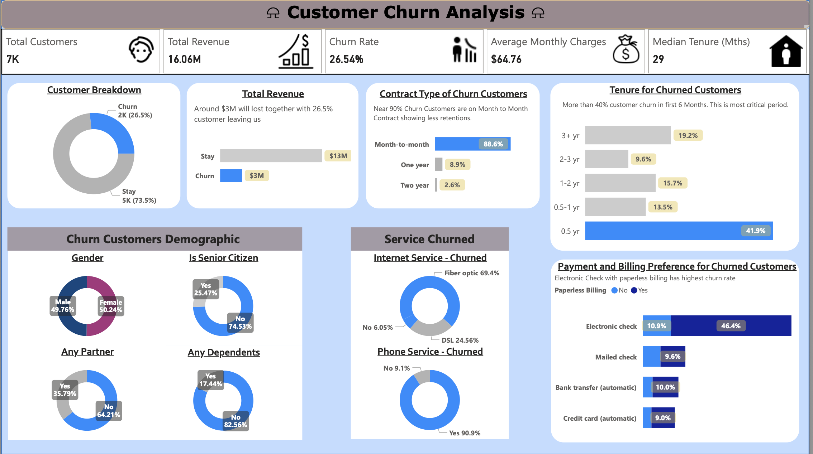

# 📉 SaaS Customer Churn Analysis Dashboard

A Power BI dashboard project analyzing churn patterns for a subscription-based telecom service. Built using a public dataset with near 7,000 customer records.

---

## 📌 Project Objective

Understand which customer profiles are most likely to churn, and uncover key drivers such as contract type, monthly charges, and service features. The goal is to help reduce churn and support retention strategies.

---

## 🗂️ Dataset Information

- **Source**: [Kaggle Telco Customer Churn Dataset](https://www.kaggle.com/datasets/blastchar/telco-customer-churn/data)
- **Size**: 7,043 rows x 21 columns
- **Timeframe**: Historical (no date column included)
- **Target Variable**: `Churn` (Yes/No)

### 🔑 Key Columns:
- `gender`, `SeniorCitizen`, `Partner`, `Dependents`
- `Contract`, `PaperlessBilling`, `PaymentMethod`
- `InternetService`, `OnlineSecurity`, `StreamingTV`, etc.
- `MonthlyCharges`, `TotalCharges`, `tenure`

---

## 🎯 KPIs (DAX Measures)

- Total Customers
- Total Revenue
- Churn Rate (%)
- Avg Monthly Charges
- Median Tenure(Mths) 

---

## 📊 Dashboard Visuals

| Visual | Description |
|--------|-------------|
| 🔁 Donut Chart | Churned vs Non-Churned Customers |
| 📊 Bar Chart | Revenue Loss by Churn|
| 📊 Bar Chart | Contract Type of Churn|
| 📊 Bar Chart | Tenure Length of Churn|
| 📊 Bar Chart | Payment and Billing Preference for Churned Customers |
| 🔁 Donut Chart | Churned Customers Demographic|
| 🔁 Donut Chart | Services Churned|
| 🧠 Tooltip Page| Key Insights |

---

## 🔍 Key Insights

**🧠 No Dependents = Higher Churn:**
- Only 17% of churned customers have dependents.

**📉 Tenure < 6 Months = Risk Zone:**
- 42% of churn happens within first 6 months.

**🧬Non Senior Citizens = Higher Churn:**
- Around 75% of churn are non-Senior Citizens.

**💸 Electronic Check = Risky:**
- Nearly 46% of churned customers paid via electronic check.

---

## 🛠 Tools Used

- Power BI
- DAX
---

## 📁 Files

- [Download Power BI File](power%20bi/SaaS%20Customer%20Churn%20Analysis.pbix)
- [Download pdf](pdf/SaaS_Customer_Churn_Analysis.pdf)
- [Download Raw Data File](data/WA_Fn-UseC_-Telco-Customer-Churn.csv)
- [Download Dashboard image](images/dashboard_overview.png)
- `README.md`

---

